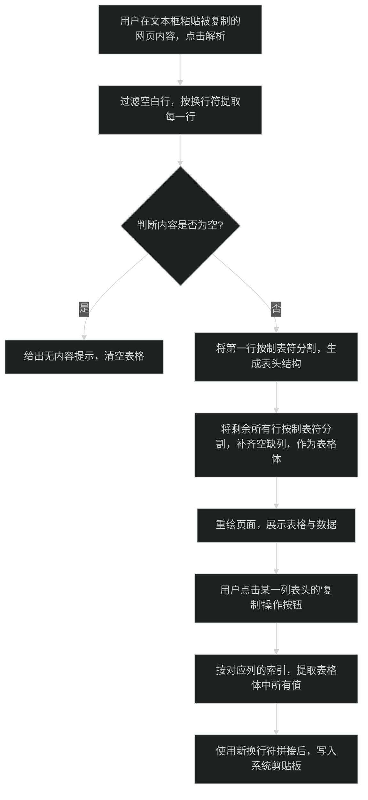

# 文本转表格工具 (Excel-like Tool) 技术方案

## 需求背景
用户经常从网页列表复制带格式的文本（通常由制表符 `\t` 分隔列表，由换行符 `\n` 分隔行）。目前缺少一个轻量级的方式将其可视化并针对列进行提取。为避免开启沉重的Excel，希望在本地 Dev Toolbox 中增加一个类似于Excel表格页面。

## 功能设计
1. **输入区**：一个多行文本输入框，用户在此粘贴想要处理的文本。
2. **操作区**：
   - 「解析生成表格」按钮：将文本根据换行、制表符分割成表结构（可设置输入框改变时自动解析）。
   - 「清空」按钮：清空输入输出。
3. **输出展示区（表格）**：
   - 使用 Flutter 的 `DataTable`，由 `SingleChildScrollView` 包裹以支持横向和纵向滚动。
   - 提取第一行作为**表头 (Columns)**。
   - 表头文本旁附带一键复制的图标，点击可复制整列（方便后续批量操作）。
4. **列提取复制功能**：遍历表格选中列的所有数据，将值组装后写入系统剪贴板。

## 逻辑流程图 (Mermaid)

## 修改计划
1. **新增文件**：`lib/tools/excel_format_tool.dart`，负责实现界面和核心逻辑。
2. **修改文件**：`lib/main.dart` 导航侧边栏，新增标签页（例如「表格提取」或「Excel提取」）。

## 【等待用户确认事项】
- 针对粘贴过来的数据，**默认首行就是表头**可以吗？因为需要做表头才能对每一列执行复制等操作。如果有时候没有表头，我是否需要加一个“首行是否为表头”的勾选项？
- 不引入重型的第三方表格包，**直接利用原生的 DataTable 组件手搓**。原生的基本够用，能看清格式、能按列复制，是否同意该技术选型的精简做法？

（请您先看看，觉得计划OK后，给出开始编码的指令！）
